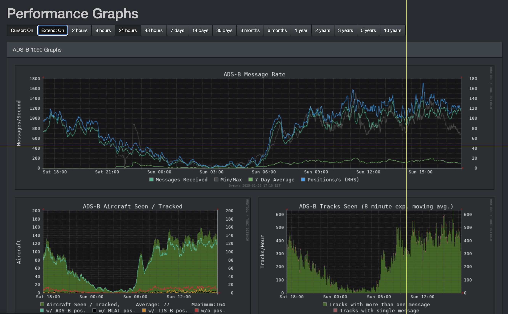

# Graphs1090 Crosshairs Userscript

A userscript that enhances the Graphs1090 interface by adding crosshairs to graphs with a toggle button for both the main and individual graph pages.

## Demo

## Extended Crosshairs Option
The latest version has a toggle button to extend the crosshairs across the whole page to compare points in graphs above/below or to either side.

## Installation

1. Install [Tampermonkey](https://www.tampermonkey.net/) for your browser.
2. [Click here to install with Tampermonkey](https://raw.githubusercontent.com/brianmcentire/graphs1090-crosshairs-userscript/refs/heads/main/graphs1090-crosshairs-userscript.js).
3. Refresh your Graphs1090 page.

## Features

- Adds crosshairs to Graphs1090 graphs for improved readability and precision.
- Toggle crosshairs on and off with a simple button.
- Automatically adjusts crosshair color based on the graph's background for better visibility.

## License

MIT © 2025 Brian McEntire
